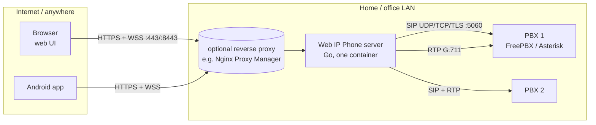

# Architecture

## 1. Overview



Clients only ever talk HTTPS/WebSocket to the server. The server is a SIP user agent on the LAN: it
registers the virtual phones (extensions) with the PBXs and places/answers calls for its clients, and
relays the audio between the RTP stream (PBX side) and the WebSocket (client side). Only one TCP port
has to be reachable from outside, so it works through any reverse proxy and needs no UDP port
forwarding, STUN or TURN.

Terms: a **virtual phone** is a SIP account on a PBX (extension + credentials). It is either
**provisioned** by an admin (shared, granted to users) or **own** (created by a user on a PBX where the
admin allowed "any SIP account"). A **client** is one connected browser tab or app instance.

## 2. Server components

| Package | Role |
|---|---|
| `cmd/webphone` | wiring, TLS certificate (self-signed or provided, hot-reloaded), setup token, shutdown, CLI recovery commands |
| `internal/httpapi` | REST API, WebSocket endpoint, static SPA; security middleware (client IP/proxy resolution, CSRF, headers, rate limits) |
| `internal/phone` | `Service`: clients, online phones, call ownership, authorization of every call command, call history |
| `internal/sipua` | SIP engine on [sipgo](https://github.com/emiago/sipgo): registrations, calls, SDP, in-dialog requests |
| `internal/media` | RTP sessions (paced sender, RFC 4733 DTMF, symmetric RTP), G.711 |
| `internal/store` | SQLite: users, sessions, PBXs, phones, access grants, calls, audit log, settings |
| `internal/auth` | argon2id, session tokens, TOTP, login throttle, rate limiter |
| `internal/secretbox` | AES-256-GCM encryption of SIP passwords and TOTP seeds (context-bound) |
| `internal/dialrule` | Asterisk-style dial patterns per user and PBX |

## 3. Data model

```
users ─┬─< sessions            (token hash, kind web|app, idle + absolute expiry)
       ├─< recovery_codes      (SHA-256 of 2FA recovery codes)
       ├─< pbx_access >── pbxs (mode: any | selected, dial_rules)
       ├─< phone_access >── phones   (provisioned phones granted to the user)
       └─< phones (owner_id)   (own phones; owner_id NULL = provisioned)
calls (history), audit_log, settings (policy JSON)
```

**Authorization rule** (`store.usableSQL`): user U may use phone P iff P's PBX is enabled, U has a
`pbx_access` row for it, and either P is U's own phone and the mode is `any`, or P is provisioned and
granted to U in `phone_access`. Everything (REST, WebSocket commands, incoming-call routing) goes
through this rule; `phone.Service.Revalidate` re-applies it to live connections and calls after every
admin change, so revoked access ends calls immediately.

## 4. Registration

A phone with "receive incoming calls" on is registered **while at least one client is online with
it** (plus 45 s grace so a reload or network switch does not bounce it). The Contact URI carries a
random per-phone token (`sip:w<26 base32 chars>@<server-ip>:5070`); incoming INVITEs are routed by
that token, not by extension number. Unregistering sends `Contact: <our uri>;expires=0`: only our
binding is removed, never a desk phone registered on the same extension. The PBX must allow several
contacts per extension for that to coexist (FreePBX: *Max Contacts* > 1).

## 5. Call flows

Outgoing:

```
client            server (phone.Service / sipua)            PBX
  │ {"type":"dial"}    │                                      │
  ├──────────────────► authorize phone + dial rules + limits  │
  │                    │ INVITE (SDP offer PCMU/PCMA/101) ───►│
  │                    │◄──────── 401 ── INVITE+auth ────────►│
  │◄─ call ringing ────│◄──────── 180 / 183+SDP (early media) │
  │◄─ call active ─────│◄──────── 200 OK ── ACK ─────────────►│
  │══ binary audio ═══►│ paced RTP 20 ms ════════════════════►│
  │◄══ binary audio ═══│◄═══════════════════════════ RTP ═════│
```

Incoming: the PBX sends INVITE to the Contact token; the engine asks `phone.Service.IncomingCall`,
which rings every idle client online on that phone whose user may still use it (486 if all are busy,
480 if none is online). The first client that answers gets the call; the others see
`answered_elsewhere`. CANCEL from the PBX becomes a missed call.

Hold = re-INVITE with `a=sendonly`; transfer = REFER (blind); DTMF = RFC 4733 events or SIP INFO
(per PBX). Re-INVITE/UPDATE from the PBX (hold, session refresh, address changes) are answered and
applied to the RTP session. A call whose RTP stops for 90 s (and is not on hold) is hung up.

**Detach/attach:** when a client's WebSocket drops mid-call, the call stays up for 30 s. The next
`hello` lists the user's active calls and the client sends `attach` to resume. The same command moves a
call between devices of the same user ("Continue here").

## 6. Media pipeline

G.711 is carried end to end, never transcoded: the negotiated codec (PCMU or PCMA, per PBX preference)
is announced in the call state, the client encodes/decodes it itself.

- **Client -> PBX:** 20 ms frames (160 bytes) over the WebSocket as binary messages `0x01 + payload`.
  The server queues them per call and sends exactly one RTP packet every 20 ms (silence when the queue
  is empty, e.g. muted), dropping backlog above 160 ms so TCP bursts never turn into lasting delay.
- **PBX -> client:** each RTP payload is forwarded immediately. The client's jitter buffer (web:
  `public/worklets/playback.js`, Android: `JitterBuffer.kt`) starts at 60 ms, grows after underruns,
  shrinks slowly while stable, and drops backlog after a network stall.
- **Web capture:** getUserMedia with echo cancellation/noise suppression/AGC -> AudioWorklet: 4th-order
  low-pass, fractional resampling to 8 kHz, G.711 encode (`capture.js`). Playback resamples 8 kHz to the
  device rate with an anti-imaging filter.
- **Android:** `AudioRecord(VOICE_COMMUNICATION)` (platform AEC/NS/AGC) at 8 kHz, or 16/48 kHz with a
  windowed-sinc decimator; `AudioTrack(USAGE_VOICE_COMMUNICATION)`; `AudioRouter` handles audio mode,
  focus and earpiece/speaker/Bluetooth/wired routing.

Why WebSocket rather than WebRTC: one HTTPS port through any reverse proxy, no ICE/TURN, identical
code path for browser and app, and G.711 at 64 kb/s needs no bandwidth adaptation. The cost is TCP
head-of-line blocking on lossy links, which the jitter buffers bound.

## 7. Request path and security layers

1. `base`: client IP from the TCP peer, or from `X-Forwarded-For` (right-most untrusted entry) only when
   the peer is a configured trusted proxy; security headers (strict CSP, HSTS, frame denial); global API
   rate limit per IP.
2. `authed`: session from the `__Host-` cookie (browser) or `Authorization: Bearer` (app) - a token is
   only valid in the transport it was issued for. Restricted sessions (temporary password, required 2FA
   not yet enrolled) reach only the endpoints needed to fix that.
3. `csrf` for cookie-authenticated state changes: `X-Requested-With` header, `Sec-Fetch-Site`, `Origin`.
   WebSocket upgrades with a cookie require a matching `Origin`.
4. Handler: strict JSON (size-limited, unknown fields rejected), validation, authorization, audit log.

On the SIP side: packets from addresses other than the configured PBXs are dropped before parsing;
incoming INVITEs must match a Contact token *and* come from that phone's PBX; RTP is accepted only from
the address in the PBX's SDP. SIP header values from users are validated against strict character sets
(sipgo does not escape header values).

## 8. Deployment

One container, `network_mode: host` (SIP/RTP need the host's LAN address), read-only root file system,
no capabilities, non-root (UID 65532), data in the `/data` volume: `webphone.db` (SQLite, WAL),
`secret.key` (master key for secretbox; or `WEBPHONE_SECRET_KEY`), `tls/` (self-signed certificate).
Only 8443/tcp (or a reverse proxy's 443) needs to be exposed. See `docs/deployment.md`.

## 9. Android app

Single-activity Compose app. `WebPhoneApp` owns `Prefs` (token encrypted with an Android Keystore
AES-GCM key), `Api` (OkHttp with `PinningTrustManager`: system CAs, or the certificate fingerprint the
user confirmed on first connect) and `PhoneClient` (the WebSocket session, same protocol as the web
client). `PhoneService` is a foreground service: type `phoneCall|microphone` during calls,
`specialUse` while waiting for calls in the background (optional; there is no push service, the
connection itself delivers incoming calls). Incoming calls ring with a CallStyle notification and a
full-screen `IncomingCallActivity` over the lock screen.

### 9.1 Incoming calls on the lock screen (since 1.0.1)

`phone/CallScreenAccess.kt` decides how a ringing call reaches the screen while the app is in the
background:

1. **Full-screen intent** of the CallStyle notification (`Notifications.incoming`). The system turns the
   screen on and starts `IncomingCallActivity` (`showWhenLocked`, `turnScreenOn`) over the keyguard. On
   Android 14+ this needs the app-op *Full screen notifications*, which is usually **not** granted to
   sideloaded apps; without it the notification is silently downgraded to a heads-up.
2. **Fallback "Display over other apps"** (`SYSTEM_ALERT_WINDOW`, user-granted): exempts the app from
   background-activity-start limits, so `PhoneClient.launchCallScreen` starts the activity itself, on
   arrival and on `SCREEN_ON`/`USER_PRESENT` (receiver in `WebPhoneApp`). No overlay is ever drawn.
3. Neither: notification only. `CallScreenPrompt` (once, after sign-in), `CallScreenBanner` (keypad) and
   `CallScreenSettings` explain it and open the right settings page.

While the app is in the foreground it shows its own incoming screen and posts no notification
(`PhoneClient.onForegroundChanged`). After answering on the lock screen, `MainActivity` sets
`setShowWhenLocked(true)` while a call is active, so the in-call screen stays over the keyguard.

## 10. Testing layers

| Layer | Where | Needs |
|---|---|---|
| Unit (Go) | `go test ./...` (+ `-race`) | nothing; httpapi tests run the whole API in-process with a fake SIP engine and a fake clock |
| SIP engine | `internal/sipua/integration_test.go` (`-tags integration`) | test Asterisk; each test engine gets its own SIP port |
| Full stack | `internal/httpapi/e2e_integration_test.go` | test Asterisk; two users call each other over REST+WS+SIP |
| Browser | `tools/browser_test.py` (Firefox, Playwright, PulseAudio null sink) | running server + Asterisk; audio checked by wrapping `WebSocket.send` / worklet port |
| Android unit | `./gradlew :app:testDebugUnitTest` | G.711, jitter buffer, decimator, URL/fingerprint |
| Android e2e | `android/scripts/e2e.py`, `lockscreen_test.py` | emulator + `tools/dev-stack.sh up`; debug/e2e builds replace the mic by a 1 kHz tone and log `CallAudio: stats` |
| Real PBX | `tools/livecall`, `REAL_PBX_NUMBER` in e2e.py | user's FreePBX, **extension 1007 only**, `*43` echo (22 s spoken intro, then echo) |

CI (`.github/workflows/ci.yml`) runs all but the Android emulator and real-PBX layers.

## 11. Release process

1. Bump `versionCode`/`versionName` in `android/app/build.gradle.kts`, commit, push, wait for CI.
2. `git tag -a vX.Y.Z -m ... && git push origin vX.Y.Z`. `release.yml` publishes
   `ghcr.io/revocx35/web-ip-phone:X.Y.Z, X.Y, X, latest` (amd64+arm64, SBOM+provenance) and creates the
   GitHub Release with `web-ip-phone-X.Y.Z.apk` + `.sha256` (signed from the `RELEASE_*` secrets).
3. `gh release edit vX.Y.Z --title "vX.Y.Z – <headline>" --notes-file ... --latest` with user-facing notes
   (what changed, why, how to upgrade; see v1.0.0/v1.0.1). Verify: download APK, `apksigner verify`
   (cert SHA-256 `89:91:AF:E5:…:2A:05:E6`), pull the image.
4. `main` pushes publish `:edge` only.

## 12. History

- **1.0.0 (2026-09-30)**: server (Go + sipgo), web UI (Preact), Android app, Docker/CI/release. Verified
  against a local Asterisk 20/22 and the user's FreePBX 17 (Asterisk 22) with real `*43` calls.
- **1.0.1 (2026-10-01)**: Android shows incoming calls over the lock screen (9.1). Reported by the user:
  "rings but I can't see the call screen unless I tap the notification".

## 13. Design decisions (and why)

- **Server-side SIP, clients on WebSocket**: one HTTPS port through any reverse proxy, no SIP/RTP/TURN
  exposure; G.711 end to end, no transcoding. WebRTC was considered and rejected for v1 (needs UDP
  reachability/ICE; NPM only proxies HTTP).
- **Go + sipgo** (BSD) rather than diago (MPL, unstable API): static binary, distroless image, own RTP code
  (small and testable).
- **Setup token** for the first admin (deviation from the original request "first visitor creates the
  admin"): the server is meant to be internet-facing; told to the user.
- **Register only while a client is online** with the phone (+45 s grace); unregister only our own contact
  (`Contact: <ours>;expires=0`, never `*`) so desk phones on the same extension are not kicked.
- **Contact token routing**: incoming INVITEs are matched by an unguessable per-phone user part, plus the
  PBX source address.
- **Credential check = REGISTER without Contact** (RFC 3261 query): does not touch bindings (verified on
  Asterisk before using it on the user's FreePBX).
- **Android TOFU pinning** of the leaf certificate (fingerprint shown in Admin -> Overview) instead of
  "trust all" for self-signed servers.
- **No push service**: background calls ride on a foreground service + WebSocket (`specialUse` FGS type
  while idle, `phoneCall|microphone` during calls).

## 14. Notes for future sessions

> **For every agent working on this repo:** after your change, update §12 History, §13 decisions and
> this section the same way (see "Before you finish" in CLAUDE.md).

**sipgo quirks (v1.6.0)** - each cost debugging time:
- CANCEL/ACK are built from the Request-URI and ignore `SetDestination`: the PBX host:port must be in the
  Request-URI or a Route header (`PBX.requestURI`).
- A transport read filter returning an error **closes the listener**; return `nil, nil` to drop a packet.
- `ServeUDP` registers the socket asynchronously; requests sent before that bind the port again
  (`Engine.Start` waits for `GetConnection`).
- `SIPDebug` and the default logger are package globals (set once: `sipgoInit`).
- Late CANCEL/BYE after the listener closed re-bind the port: `Engine.Close` waits for call goroutines.
- `DialogServerSession.WriteResponse(200)` blocks until the ACK; `DoDigestAuth` increments the CSeq;
  header values are **not** escaped or validated (hence `sipua/validate.go`).
- In-dialog requests built by sipgo use the dialog's own option functions, so `WithClientConnectionAddr`
  does not apply to them (they reuse the pooled listener connection by remote address).

**Asterisk/FreePBX behavior**: the endpoint's configured callerid replaces the From display name;
OPTIONS from unknown sources get 401 (still proves reachability); FreePBX `Max Contacts` defaults to 1.

**Environment (dev LXC 192.168.68.23)**: ~1 GB free disk (no local Docker builds of the full image; build
the binary and wrap it, see docs/development.md); port 18443 is taken (another project), use 8443/28443;
the emulator is shared with other projects (don't leave test apps or PINs behind, `-no-audio`);
Chromium's AudioWorklet hangs in containers here, test the web UI with Firefox; UI Automator does not see
heads-up notifications or dialog windows' contents unless `testTagsAsResourceId` is set in the dialog.

**User context**: FreePBX 192.168.68.143, extensions 1005-1008; test **only with 1007**; 1008 is the
production cam2sip line. The user deploys with Docker Compose, often behind Nginx Proxy Manager, and wants
releases as tag + image + GitHub Release with notes. Local secrets live in git-ignored `CLAUDE.local.md`;
the Android keystore is in `/root/.android-signing/` (never commit).

**Ideas / backlog** (not started): G.722 or Opus towards the PBX; SRTP (SDES) for PBX legs; IPv6 SIP;
attended transfer and call waiting (one call per device today); contacts/speed dial; optional WebRTC
media for lossy mobile links; Android Telecom `ConnectionService` integration (Bluetooth/car UI);
UnifiedPush or FCM for battery-friendlier background calls; F-Droid listing (reproducible build like
the user's NPM Mobile app); per-PBX outbound caller ID rules; admin UI for live registrations per contact.
