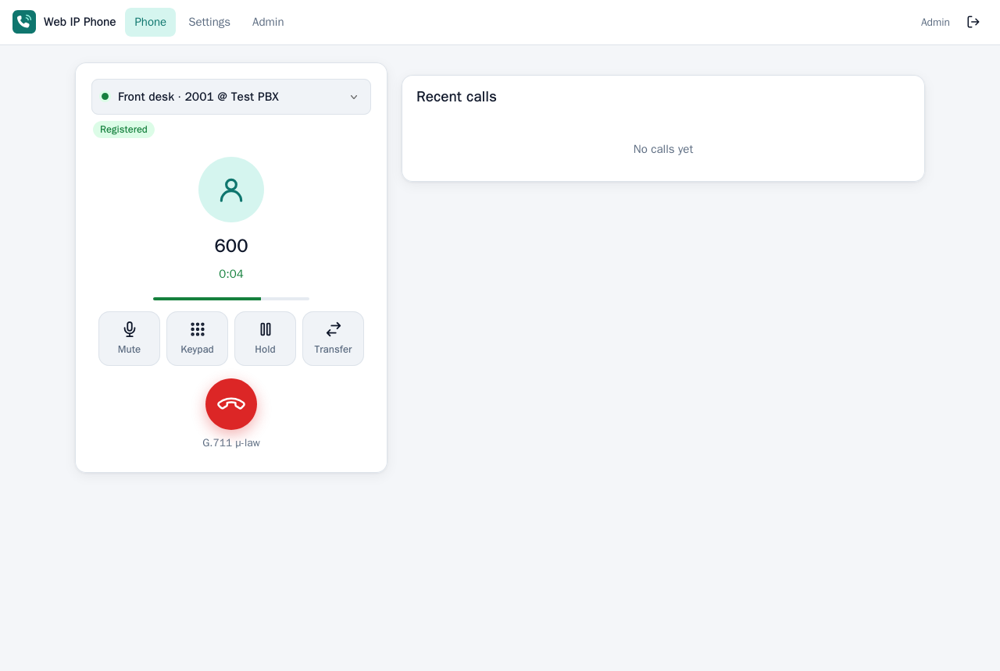
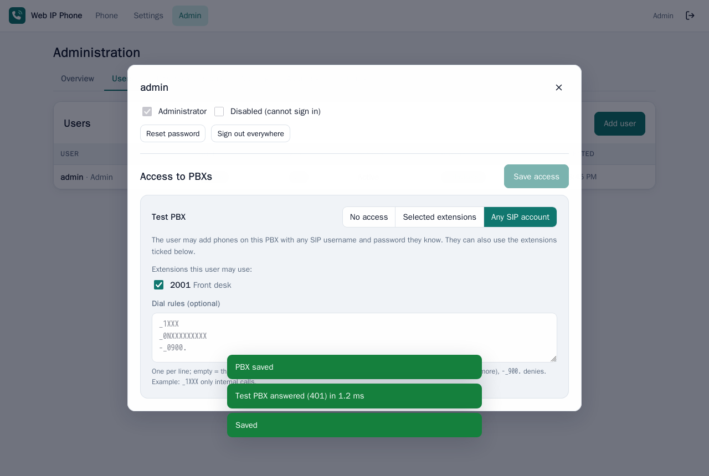
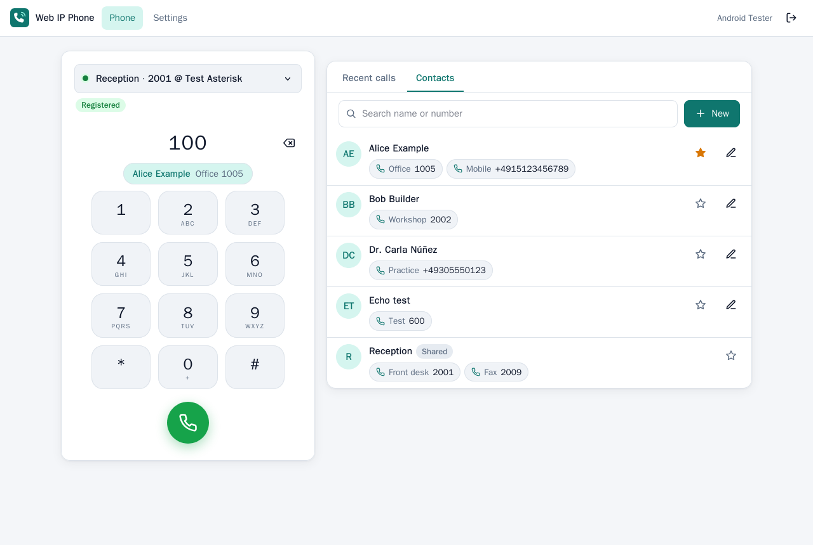
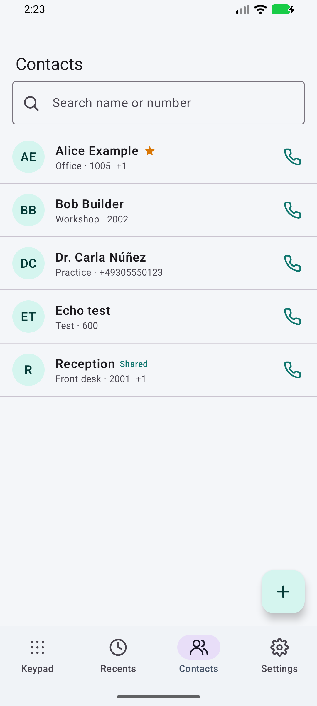
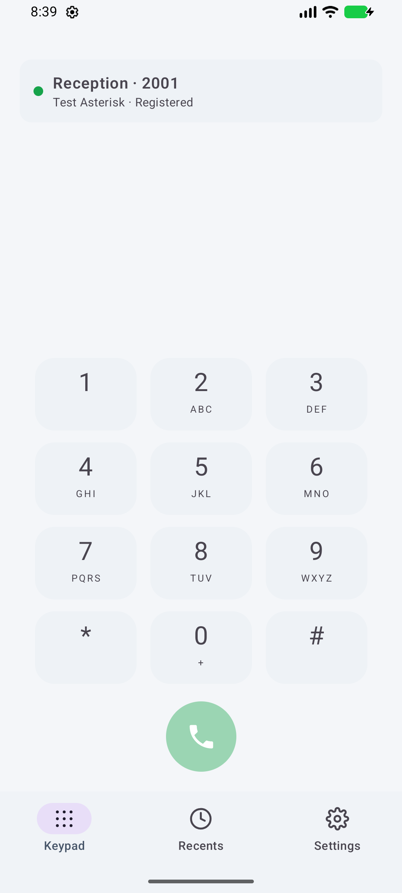
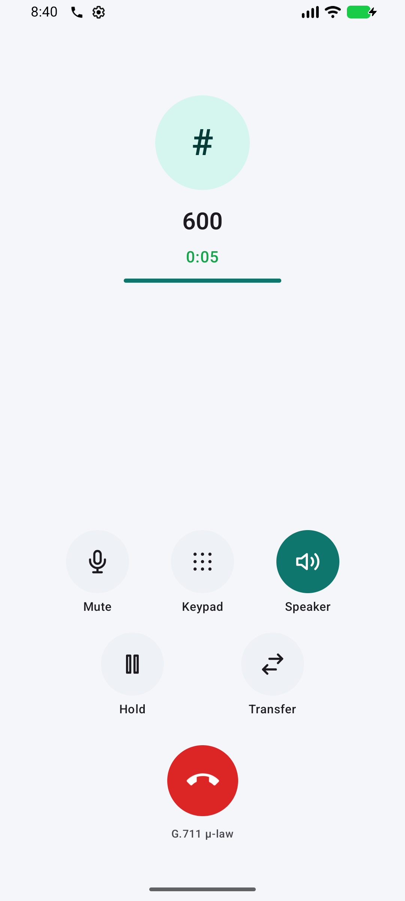
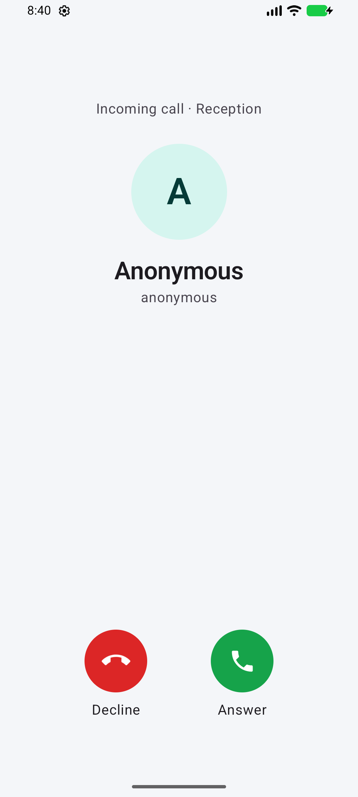
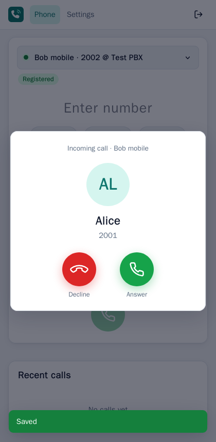

# Web IP Phone

**Use the extensions of your internal PBX from anywhere: in the browser or with a native Android app.**

Web IP Phone is a self-hosted softphone gateway. It runs next to your PBX (FreePBX, Asterisk or any
SIP PBX), registers extensions there and bridges calls to browsers and phones over a single HTTPS
port. No VPN, no SIP or RTP ports open to the internet, no SIP client configuration on the devices.

<p>


</p>
<p>


</p>
<p>




</p>

## Features

- **Web phone**: keypad, recents, mute, hold, DTMF keypad, blind transfer, incoming calls with ringtone
  and desktop notifications, audio device selection. Works in current Chrome, Edge, Firefox and Safari.
- **Android app** (Kotlin, Jetpack Compose): same features, incoming calls also when the app is closed
  (lock-screen call screen), earpiece/speaker/Bluetooth/headset, move a running call between devices.
- **Contacts**: a phone book per user, synced live between the web UI and the app, with favorites,
  several numbers per contact, search and one-click calling. Callers are shown by name (incoming call,
  notifications, recents), the keypad and transfer suggest contacts, and recent callers can be saved
  with one click. Admins can add shared contacts for everyone; the app imports single contacts from the
  phone's address book without needing the contacts permission.
- **Several PBXs**, any number of extensions, UDP/TCP/TLS, G.711 µ-law/A-law, RFC 4733 or SIP INFO DTMF.
- **Admin-controlled access**: the first visitor creates the admin account; only admins create or delete
  accounts. Per user and PBX the admin chooses *no access*, *selected extensions* (credentials stay with
  the admin) or *any SIP account* (the user enters SIP credentials they know), plus optional dial rules.
- **Security**: argon2id passwords, TOTP two-factor authentication (can be required), login throttling,
  strict CSP, CSRF and origin checks, encrypted SIP secrets, audit log, per-device sessions, certificate
  pinning in the app, hardened distroless container. See [SECURITY.md](SECURITY.md).
- **One container**, one exposed port, SQLite storage.

## Quick start

On a Linux host in the same network as your PBX (Docker with the compose plugin):

```bash
mkdir -p ~/webphone && cd ~/webphone
curl -fsSLO https://raw.githubusercontent.com/revocx35/web-ip-phone/main/deploy/docker-compose.yml
docker compose up -d
docker compose logs webphone | grep setup_token     # one-time token for the admin account
```

Open `https://<host>:8443`, accept the self-signed certificate (or put your reverse proxy in front,
see [docs/deployment.md](docs/deployment.md)), enter the setup token and create the admin account. Then:

1. **Admin -> PBXs & extensions -> Add PBX**: host/IP of the PBX as seen from this server, transport, port.
   *Test connection* checks it answers.
2. **Add extension**: extension number and SIP password (checked against the PBX before saving).
3. **Admin -> Users**: create users and set their access per PBX.
4. **Phone**: pick the phone and call.

On FreePBX, allow more than one contact for extensions that are also used by a desk phone
(*Extensions -> Advanced -> Max Contacts*), otherwise registering from here replaces the desk phone.

## Android app

Download `web-ip-phone-<version>.apk` from the [latest release](https://github.com/revocx35/web-ip-phone/releases/latest),
install it, enter your server address and sign in. With a self-signed certificate the app shows its
SHA-256 fingerprint; compare it with *Admin -> Overview* before trusting it. Details:
[docs/android.md](docs/android.md).

## Documentation

- [docs/deployment.md](docs/deployment.md): configuration, reverse proxy (Nginx Proxy Manager), TLS, PBX notes, backups
- [docs/android.md](docs/android.md): the app, background calls, battery settings
- [docs/protocol.md](docs/protocol.md): REST and WebSocket API (build your own client)
- [docs/development.md](docs/development.md): building and testing
- [ARCHITECTURE.md](ARCHITECTURE.md): how it works; [SECURITY.md](SECURITY.md): threat model and hardening

## How it works

```
Browser / Android  --HTTPS + WebSocket (G.711 audio)-->  Web IP Phone server  --SIP + RTP-->  PBX
   (anywhere)                                               (your LAN, Docker)
```

The server is a SIP user agent on your LAN. Clients never speak SIP; they send commands and 20 ms
audio frames over an authenticated WebSocket, and the server relays them to and from the PBX.

## License

[MIT](LICENSE)
